+ **論文名稱：** A CNN-Based Human Head Detection Algorithm Implemented on Edge AI Chip
+ **論文來源：** ICSSE 2020
+ **論文連結：** https://doi.org/10.1109/ICSSE50014.2020.9219260
+ **論文關鍵字：** `CNN`、`人頭檢測`、`Edge AI晶片`
<!--more-->

---

## 簡介

  近年來進行人頭檢測的許多方法都是使用 CNN (Convolutional Neural Network) 進行，但大多數的方法為了追求高準確率，通常都會增加網路的layer的層數或是增加網路的權重，導致計算量增大以及硬體需求增加。

相對的，使用整合好的 CNN IC 晶片可以得到更好功耗及計算速度，本文使用由 **視芯公司（AVSdep）** 的Mipy (Micropython) 開發板（AVS05P-S），搭配 CNN IC (AI860) 及視芯提供的訓練工具進行模型的訓練。

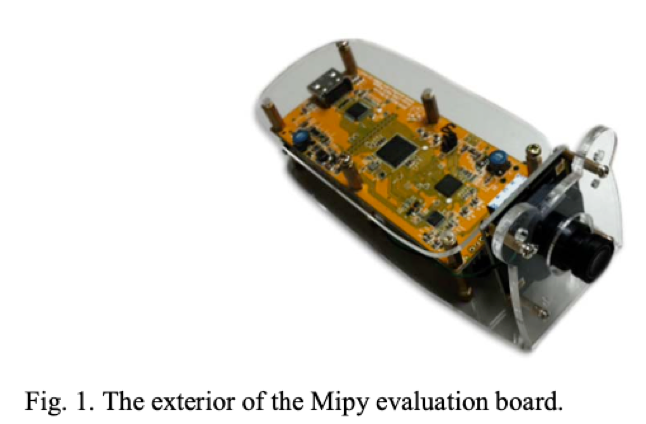  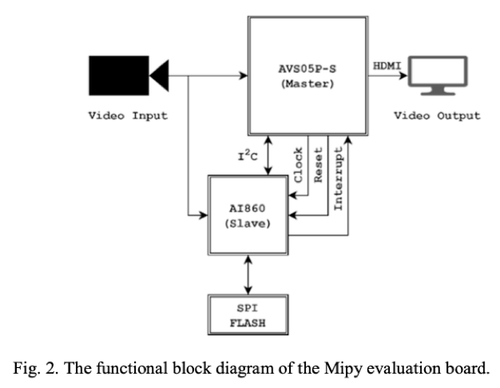

## 前置相關工作

### 訓練工具

作者使用由公司提供的訓練工具（C++ 版本）[^1]：

1. **建立資料庫（Create database tool）**
將訓練圖片編碼成二進制檔案以加速訓練時間
2. **推論工具（Inference tool）**
捕獲各種來源的影像並進行資料擴充（擴充細節請看下節）
3. **訓練工具（Training tool）**
執行訓練循環（前向傳播、後向傳播、損失計算、權重優化）

### 影像資料擴充

為了要增加模型的準確度以及避免模型過擬合（Overfitting），資料集需要大量且多樣化，因此進行資料擴增：

+ **旋轉圖片 (Rotation)**
+ **亮度調整 (Brightness adjustment)**
藉由調整圖片像素來進行亮度調整：
    + (1) $P_{new} = P_{old} \times a$
    + (2) $P_{new} = P_{old} + b$
    + (1) (2) 可以同時進行
+ **模糊處理 (Blurring image)**
隨機模糊或是銳利化圖片
+ **鏡像處理 (Mirroring image)**
+ **替換背景 (Background replacement)**
將原始圖片中固定的背景顏色替換成隨機的風景圖

## Mipy 運算過程

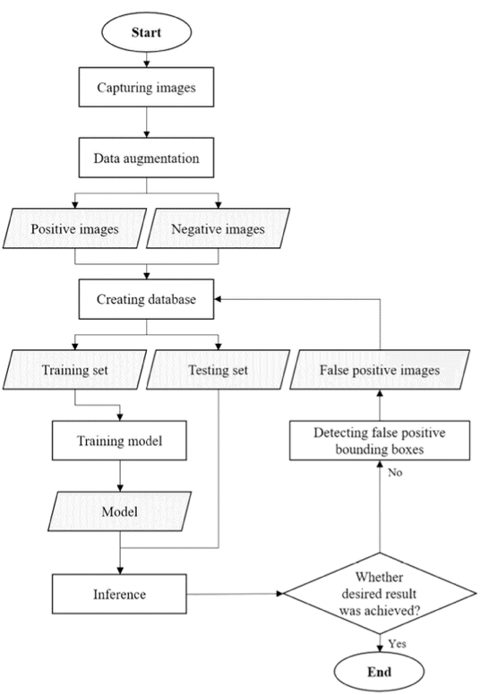

作者拍攝了一些人作為資料集，總共 8 個身體方向，而每個身體方向都包含 5 個頭部方向，分別為：向上、向後、向左、向右、向前，總共拍攝了 800 多張照片，將這些照片分成三個類別，分別為：前面、後面、側面。
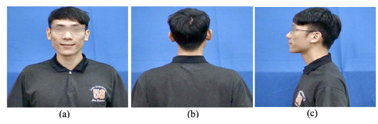

為了增加資料集的多樣性，作者使用推論工具進行資料擴增（如前面章節說明），將圖片數從800多張擴增到總共 120,000 章圖片，分成 108,000 張圖片為訓練集，12,000 張圖片為測試集，擴增參數設定如表 1。

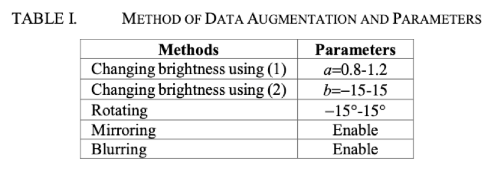

而每次建立資料庫時使用 30,000 張照片作為訓練集資料，3,000 張照片作為測試集資料，並設定輸出神經元類型：

| 編號 | 輸出表示                                                                                         |
| ---- | ------------------------------------------------------------------------------------------------ |
| 0    | 正樣本偵測                                                                                       |
| 1-4  | 類別樣本（其中兩個用來標示前、後、側面）  (+1, +1): 前面  (+1, -1): 後面 (-1, -1): 側面 |
| 5    | 負樣本偵測                                                                                       |
| 6-9  | 邊界框位置回歸                                                                                   |
    
模型超參數如下所示：
+ Optimizer: Adam
+ Batch size: 250
+ Learning rate: 0.0001
+ Weight decay: 0.0001
+ Recreate database every 30 epoch

訓練流程使用批次檔進行：

1. 執行建立資料庫工具
2. 執行訓練工具
3. 讀取紀錄訓練工具的 log
    
上述步驟進行 3 次後，產生 `G0` 做為預訓練模型，不過從下圖可以發現訓練誤差遠低於測試誤差。

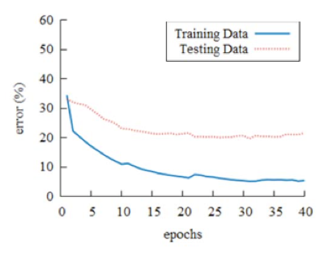

因此作者把在風景照中的 False Positive Data（被偵測為人頭但是實際上不是人頭的圖像）是為新的負樣本資料，加入訓練資料中增加模型準確度。

並設定閥值（Threadshold）來找出需要額外再訓練的圖片，公式如下：
    $$S = N_0 - N_5$$
+ $N_0$: 正樣本信心分數
+ $N_5$: 負樣本信心分數

這邊訓練的過程就是使用預訓練時的批次檔作為訓練循環，直到大多數的負樣本時將停止訓練，第一次訓練完的模型稱為 `G1`，作者提到說驗證 `G1` 的過程中發現許多 False Positive Data，經過重複進行修正和訓練後，第二次訓練完成的模型稱為 `G2`，以此類推，在 `G4` 檢測到的 False Positive Data 已經很少，但準確度依舊只有 58.9%，判斷為 overfitting，因此作者決定增加其他訓練資料。
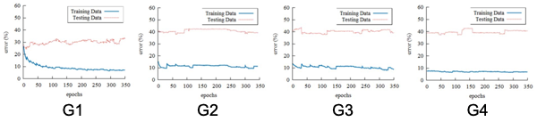

這邊增加的資料為 **Label Face in the Wild (LFW)[^2]**，挑選的標準為照片中只能出現一個人，以及臉部不可以被其他東西覆蓋，經過篩選後共 9,131 張照片被挑選，其中 1/4 作為測試集，剩餘資料作為訓練集使用。

加入 LFW 訓練後，訓練出了 `G5`、`G6` 兩個模型，準確率也分別到達 65.1% 和 70.1%。

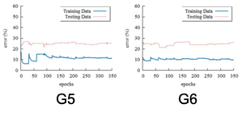

## 實驗結果與分析

將訓練好的模型載入到 AI860 後， Mipy 開發板可以執行人頭偵測任務（如下圖所示）。
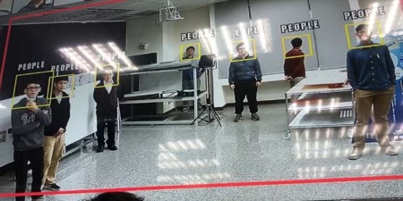

作者也分析了加入 LFW 前後的比較差異，如下表 3、4 所示，我們可以發現準確率提升了 6 %，但是上升幅度並不夠明顯，於是將各種類別（前、後、側面）的資料拆開檢視後發現正面的準確度遠高於側面與後面（如下表 G5/G6 Front View），作者研判原因是因為加入的 LFW dataset 都是正面臉部的關係，導致資料不平衡的情況發生。
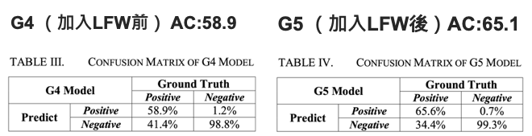
 
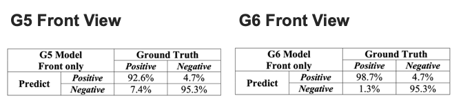

## 結論

本文利用的視芯公司（AVSdep）提供的訓練工具訓練出模型後，部署在開發板及 CNN IC 晶片上後，可以順利執行人頭辨識的任務（Human Head Detection）。其中訓練完的模型正面臉部的準確率可以達到 98.7%，模型應用在實時的檢測系統上也足夠準確，使用完整的訓練資料時，Mipy 開發板可以獲得足夠的準確率以執行實際應用。

## 個人心得

筆者覺得這篇論文有點像是視芯公司的業配文，主要實作細節並沒有闡述太多關於 CNN IC 晶片網路架構的部分，另外在 `G1` ~ `G4` 的訓練過程中，testing loss 也都並沒有下降，感覺 False Positive Correction （誤報修正）並沒有太大作用，加入 LFW 後才有明顯改善，但效果仍然有待加強，後文在分析準確率上升問題時，很可惜的並沒有看到像是 `G4 (Front View)` 或是 `G5 Back/Side View` 的 Confusion Matrix 來做比較，導致只能聽從作者分析結論並沒有實驗數據參佐。

[^1]: Advance Video System CO., LTD (AVSdsp), AI courses, requirements, tool updates, Q&A area: CNN Tool v0.0.1.2c, Available: http://www.avsdsp.com/AI_Data.html 
[^2]: G. B. Huang, M. Mattar, T. Berg, and E. Learned-Miller, “Labeled faces in the wild: A database for studying face recognition in unconstrained environments,” Technical Report, University of Massachusetts, Amherst, Oct. 2007. 
