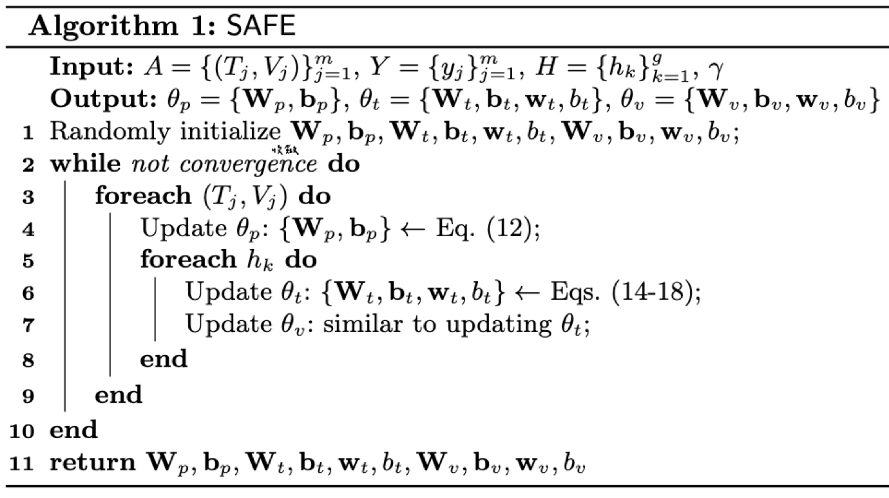
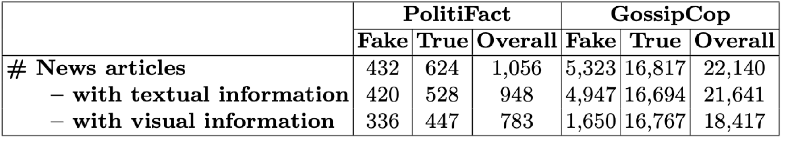

> Zhou, Xinyi & Wu, Jindi & Zafarani, Reza. (2020). SAFE: Similarity-Aware Multi-Modal Fake News Detection. 

## Introduction

### Fake News Detection

假新聞（故意且可驗證虛假的新聞文章）通常包含文本和視覺的資訊，現有的基於內容的假新聞檢測方法不是只考慮文本信息，就是結合兩種類型的數據而忽略關係（相似性）。
作者認為在判斷假新聞的任務上，理解這種關係（相似性）以預測假新聞的價值有兩個方面。

<!--more-->

### Relationship (similarity) for predicting fake news

一些假新聞（或可信度低的新聞）為了吸引公眾注意力，更喜歡使用戲劇性、幽默（滑稽）和誘人的圖像，其內容與新聞文本中的實際內容相去甚遠。

所以當一篇假新聞文章講述一個帶有虛構場景或陳述的故事時，是很難找到相關的和未經處理的圖像來匹配這些虛構的內容，因此當創作者使用未經處理的圖像來支持非事實的場景或陳述時，假新聞的文本和視覺信息之間是存在「**差距**」的。

 

### <u>S</u>imilarity-<u>A</u>ware <u>F</u>ak<u>E</u> news detection method (SAFE)

SAFE 由三個模塊組成：

+ 多模態（文本和視覺）特徵提取
+ 模態內（模態獨立）假新聞預測
+ 跨模態相似度提取

對於每篇新聞文章，會用神經網絡自動獲取其文本和影像的潛在表達式，並且計算出它們之間的相似性後，聯合學習新聞文本和視覺的表達式及相似性來預測假新聞。

作者所提出的方法主要的目的在識別新聞文章在其文本或圖像上的虛假性，或文本和圖像之間的**不匹配**。

### Contributions

本文是第一個提出藉由觀察新聞文本和視覺信息之間的關係（相似性）在辨識假新聞任務上，文中提出了一種聯合利用多模態（文本和視覺）和之間的相似性來學習新聞文章的表達式並預測假新聞的方法。

## Methodology

### Problem Definition and Key Notation

- Given a news article $A = \{T, V \}$   ( $T = $ text information, $V = $ visual information)
- Denote $t,v  \in \mathbb{R}^d$ as corresponding representations,  $t = M_t(T, \theta_t), v=M_v(V, \theta_v)$
- Let $s = M_s(t, v)$ denote the similarity between $t$ and $v$ , where $s \in [0, 1]$
- Goal: $M_p: (M_t, M_v, M_s) \overset{(\theta_t, \theta_v, \theta_p)}{\longrightarrow} \hat{y} \in [0,1]$, where $\theta_*$ are parameters to be learned
  - Determine whether $A$  is fake news $(\hat{y} = 1)$ or true one $(\hat{y} = 0)$.
  - By investigating its textual, visual information, and their relationship.

### Feature Extraction 

#### Text

在新聞文本的部分 SAFE 透過引入額外的全連接層來擴展 Text-CNN 來提取每篇新聞文章的文本特徵。

#### Image

首先使用預訓練的 image2sentence 模型將新聞內容中的圖像轉換成文字訊息後，同樣使用和處理文字相同的 Text-CNN 來提取特徵。

跟目前的多模態假新聞檢測研究相比，大部分的方法通常直接應用預訓練的 CNN 模型（例如 VGG）來獲取新聞圖像的表達式，而本文為了要計算跨模態的相似性時，所以使用 image2sentence 將圖像先轉為文字來保持一致性。

### Modal-independent Fake News Detection

為了在預測假新聞時正確表示新聞文本和視覺信息，我們的目標是將提取的新聞內容的文本和視覺特徵正確地映射到為假新聞的機率，並進一步映射到它們的實際標籤。

計算假新聞機率公式為

$$M_p(t,v) = 1 \dot{ } \text{softmax}(W_p(t \oplus v)+b_p)  $$

其中 $1 = [1,0]^T$, $W_p \in \mathbb{R}^{2 \times 2d}$ 和 $b_p \in \mathbb{R}^{2}$ 是要被訓練的參數。

Cross-entropy-based （交叉熵） loss function:

$$L_p(\theta_t, \theta_v, \theta_p) = -\mathbb{E}_{(a,y) \sim (A,Y)}(y \log M_p(t,v) + (1-y)\log(1-M_p(t,v)))$$

### Cross-modal Similarity Extraction

大多數的方法都是分開處理不同的模態特徵 $(t, v)$，只是將它們連接起來，並沒有觀察它們之間的關係。然而作者提到說除此之外，還可以通過評估文本信息與其視覺信息的（非）相關性來檢測新聞文章的虛假性。

假新聞創作者有時會主動使用不相關的圖像進行虛假陳述以吸引讀者的注意力，或者由於難以找到支持的非造假圖像而被迫使用它們，與提供相關文本和視覺信息的真實新聞文章相比，那些文本和圖像不相關的文章更有可能是假的。

作者這邊稍微修改餘弦相似度，定義新聞文本和視覺信息之間的相關性如下：

$$M_s(t,v) = \frac{t \cdot v + \|t\|\|v\| }{2 \|t\|\|v\| } $$

讓 $M_s(t,v)$ 的值為正數且 $\in [0,1]$，$M_s(t,v) \to 0$ 表示 $t, v$ 相差甚遠，$M_s(t,v) \to 1$ 表示 $t, v$ 幾乎相同。

假設從純相似性角度分析時，與文本和圖像匹配的新聞文章相比，文本和視覺信息不匹配的新聞文章更可能是假的，定義 Cross-entropy-based （交叉熵） loss function：

$$L_S(\theta_t, \theta_v) = -\mathbb{E}_{(a,y) \sim (A,Y)}(y \log (1-M_s(t,v)) + (1-y)\log M_s(t,v))$$

### Model Integration and Joint Learning

在檢測假新聞時，我們的目標是透過文本、視覺信息和它們之間的關係去正確識別假新聞。

因此定義最終 loss function：

$$L(\theta_t, \theta_v, \theta_p) = \alpha L_p(\theta_t, \theta_v, \theta_p) + \beta L_s(\theta_t, \theta_v)$$

$$L_p(\theta_t, \theta_v, \theta_p) = -\mathbb{E}_{(a,y) \sim (A,Y)}(y \log M_p(t,v) + (1-y)\log(1-M_p(t,v)))$$

$$L_S(\theta_t, \theta_v) = -\mathbb{E}_{(a,y) \sim (A,Y)}(y \log (1-M_s(t,v)) + (1-y)\log M_s(t,v))$$

## Optimization

 

## Experiments

### Setup

#### Dataset

FakeNewsNet

+ PolitiFact (politifact.com) (2002.05 ~ 2018.07)  美國政治聲明和報告的非營利性事實核查網站。
+ GossipCop (gossipcop.com) (2000.07 ~ 2018.12) 對雜誌和報紙上發表的名人報導和娛樂故事進行事實核查。

#### Baselines

1. **文本 (LIWC)**：廣泛接受的心理語言學詞典
2. **視覺（VGG-19）**：使用微調的 VGG-19 作為基線之一
3. **多模態信息（att-RNN）：**
   使用帶有注意力機制 (Attention) 的 LSTM 和 VGG-19 來融合新聞文章的文本、視覺和社交平台特徵。 （為了公平，排除社交資訊）
4. **SAFE\T**：不使用文本信息
5. **SAFE\V**：不使用視覺信息
6. **SAFE\S**：不捕捉文本和視覺特徵之間的關係（相似性）。 在這種情況下，每個新聞的特徵通過連接它們來融合
7. **SAFE\W**：僅評估文本和視覺信息之間的關係。 在這種情況下，分類器與跨模態相似性提取模塊的輸出直接相連。

### Performance Analysis

+ 根據兩個數據集的準確度值和 F1 分數，SAFE 的表現優於所有 baseline。
+ 在 PolitiFact 上，準確度排序：SAFE（多模態）> att-RNN（多模態）$\approx$ LIWC（文本）> VGG-19（視覺）
+ 在 GossipCop 上，準確度排序： SAFE（多模態）> VGG-19（視覺）> att-RNN（多模態）> LIWC（文本）

### Module Analysis

1. SAFE 在所有變體中表現最佳，
2. 使用多模態信息（SAFE\S 或 SAFE\W）比使用單模態信息（SAFE\T 或 SAFE\V）表現更好
3. 獨立使用多模態信息（SAFE\S）或挖掘它們之間的關係（SAFE\W）來檢測假新聞兩者的準確度是可比的
4. 文本信息（SAFE\V）比視覺信息（SAFE\T）更重要

 

### Parameter Analysis

α 和 β 用於分配多模態特徵 (α) 和跨模態的相似性 (β) 之間的相對重要性，準確度範圍 0.75~0.85，F1 範圍 0.8~0.9。

在兩個資料集上 α 和 β 的最佳比例也不同，這再次驗證了多模態信息和跨模態關係在預測假新聞中的重要性：

+ PolitiFact: α : β = 0.4 : 0.6  
+ GossipCop: α : β = 0.6 : 0.4 

### Case Study

這邊作者提出兩個問題：

+ 是否存在任何真實世界的假新聞故事，其文本和視覺信息彼此之間沒有密切關聯？
+ 如果存在，SAFE 能否正確識別這種無關性並進一步識別其虛假性？

為此，作者瀏覽了兩個數據集中的新聞文章，並將它們的真實標籤 (ground truth) 與 SAFE 計算的相似度得分進行了比較。

一些虛構故事存在文本和視覺信息之間的差距可歸類為（但不限於）兩個原因：

1. 這樣的故事很難得到未經處理的圖像的支持： 在 Fig.5 (a) 中，實際上沒有與投票和賬單相關的圖像。在與真正親密關係的情侶 Fig.6 (c) 相比，假情侶往往很少有合影或使用拼貼畫 Fig.5 (c)。

2. 使用**有吸引力**但不密切相關的圖像可以幫助增加新聞流量： 

   Fig.5 (b) 中的假新聞包括一張與死亡故事相衝突的微笑人物圖像

SAFE 有助於正確評估新聞文本和視覺信息之間的關係（相似性）。

對於 Fig.5 中的假新聞，它們的相似度得分 $s$ 都很低，SAFE 正確地將它們標記為假新聞。 類似地，SAFE 為 Fig.6 中的所有真實新聞故事分配了高相似度分數 $s$ ，並將它們預測為真實新聞。

## Conclusions

+ 本文針對假新聞檢測任務提出了一種相似性感知 (similarity-aware) 的多模態方法 SAFE。
+ 該方法提取新聞內容的文本和視覺特徵，並觀察它們之間的關係。
+ 實驗結果表明，多模態特徵和跨模態關係（相似性）在假新聞檢測中具有相當的重要性。

## Comments
- Add across-modal relationship (similarity) to detect fake news detection
- Use image2sentence get image caption 
  - Modify cosine similarity equation
- Baseline:
  - Text feature baseline only one of traditional method
  - Multi-modal baseline only one to compared 