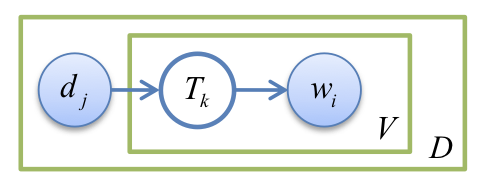

## Kaggle competitions

> 2020: Information Retrieval and Applications<br>
> Homework 4: PLSA<br>
> https://www.kaggle.com/c/2020-information-retrieval-and-applications-hw4-v2

## Github code

> https://github.com/chiachun2491/NTUST_IR/tree/master/homework4

## Homework report

### 使用的 tool

Python, Jupyter, numpy, pandas, collections.Counter, scipy.sparse, numba.jit, datetime

### 資料前處理

1. 將 `doc_list.txt`, `query_list.txt` 讀檔進來後，之後將每個 doc 使用 `collections.Counter` 儲存到 `dict`，每個 query 都使用 `split()` 儲存到 `dict`。
2. 這次 Lexicon 的生成方式跟之前不一樣，之前在生成 Lexicon 時只看 `query_list` 的所有單詞，這次先將 doc 和 query 出現過的詞加入 Lexicon 並先計算好 document length, `c(w, d)`, `P(w|d)`, `P(w|BG)` 先算好供後面算 term weight 使用。為了加速運算，決定還是減少單字的數量，只取出現次數遞減取前 10000 個單字，再把 query 的字也加進去。


### PLSA 模型參數調整

* PLSA term weight 公式：

  $P\left ( q|d_{j} \right ) \approx \prod_{ i= 1}^{|q|} P{}'\left ( q|d_{j} \right )$

  $P{}'\left ( q|d_{j} \right ) = \alpha \cdot P\left ( w_{i} | d_{j} \right ) + \beta \cdot \sum_{k=1}^{K} P\left ( w_{i} | T_{k} \right )P\left ( T_{k} | d_{j} \right ) + (1 -\alpha -\beta ) \cdot P\left ( w_{i} | BG \right )$

* 最終使用參數（Kaggle Public Score: 0.58052）：

  * `K` = `48` / `alpha` = `0.65` / `beta` = `0.2`

* 使用的參數對照分數表現圖
  


### 模型運作原理

PLSA 跟 LSA 的差別在加入的機率的概念，，讓我們可以將單詞對應到主題，再從主題對應到文章，使用兩層的機率分佈對整個樣本空間建模，其中使用 EM-Algorithm 將 `P(w|T)` 和 `P(T|d)` 重複進行 E-step 和 M-Step 直到算出的 log-likelihood 收斂到某個值。



PLSA 的優點在透過找出潛在的主題分類解決了在 query index term 發生「一詞多義」或「同義詞」的問題，讓搜尋結果更好，而缺點在於隨著 document 和 index term 數量增加，訓練參數也得線性增加，且 PLSA 針對新文件的 fold-in 效果比較不好。

### 個人心得

　　作業一開始都沒有過 baseline，後來第二週老師給了沒有加入 PLSA 的參數，我直接先以那個 baseline 為目標，因為沒有加入 PLSA，所以一開始就只有算 query 的 index term (226 個)，來到了 0.53374，但是跟別人做一樣的方式，別人竟然 0.54055，比較之後發現，實作 background language model 的時候把長度也縮減了，應該不在 query 的字也要算進去，修正後就直接超過了 8-Topic 的 baseline。

　　接著實作 PLSA 的部分，但效果都比之前的還要爛，中間還一度發現自己的 `P(w|T)` random initial 實作錯誤，後來只使用 query index term 去分類主題的效果並不好，PLSA 的特性就是會找出同義詞的情況，如果不把其他 document 的單字考慮進去，應該沒什麼效果，於是就把 Lexicon 開始擴增到 10020，但是效果並不大，所以就開始調整alpha 和 beta，**最後發現 alpha: 0.65-0.8, beta: 0.1-0.25, iter 30 次的效果是最好的**，所以後面就把 topic 往上增加，也都維持用這個參數的範圍做測試。

　　最後 topic 設為 48，我也把每個分類的前 10 名的單字調出來看，發現有一些分類真的是有效果的，這時候才覺得自己的實作是正確的。

```
Topic  1 (research):  research develop scienc amp scientist univers new year institut scientif
Topic  10 （family）:  women say would one children like time mother child life
Topic  17 (finance):  per bank dollar cent market rate year price fund stock
Topic  45 (ocean):  sea island fish ship said water border area whale vietnam
```

　　這邊也有發現有一些單詞應該是可以設為停用字的，像是長度只有1個字（c, u, 1, 2, 3...）但寫報告的時候才想到要調單字出來看，所以就來不及實作了

```
Topic  0 :  c lab poll ms hold ld swing maj 3 david
Topic  7 :  1 2 research 3 4 1993 1992 1991 5 use
Topic  24 :  report state u accord unit intern million firm govern korea
Topic  41 :  1 2 3 5 4 6 0 8 7 9
```